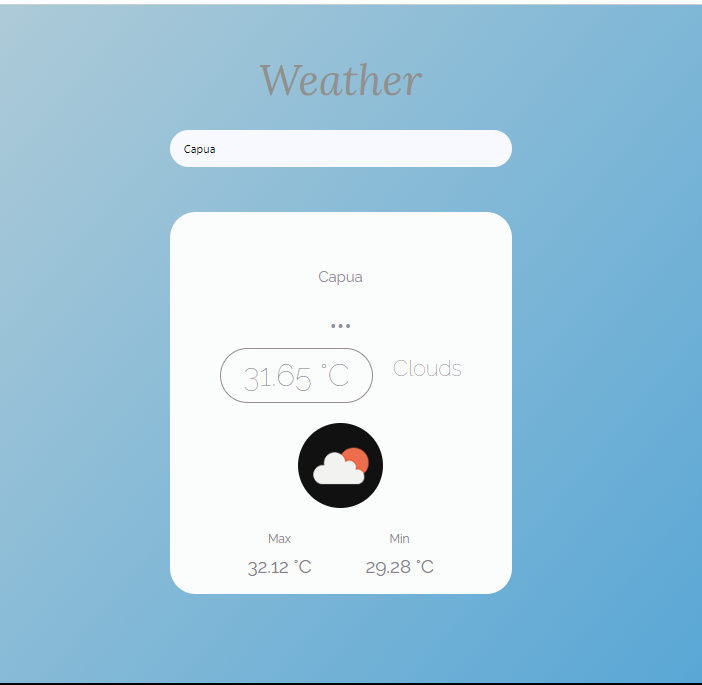

# Weather app ReactJS project

### Api used
[Open Weather API](https://openweathermap.org/api)

### Api URL
(`https://api.openweathermap.org/data/2.5/weather?q=${CITY_NAME}&appid=${API_KEY}&units=metric`)

